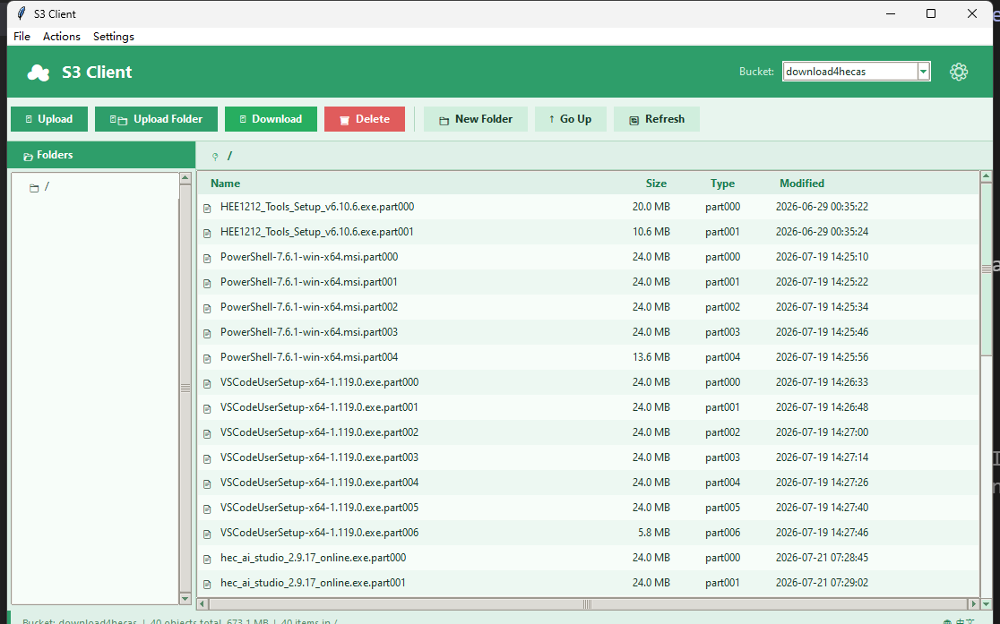

# S3 Client

[中文](README.md) | [English](README.en.md)

A graphical Cloudflare R2 object manager for Windows. Browse the objects in a bucket, upload and download files, create virtual folders, and delete objects or entire prefixes — all without memorizing S3 commands. The UI is bilingual (Chinese/English): it auto-selects based on your OS language at launch, and can be switched manually at any time.

> This project talks to Cloudflare R2 through its S3-compatible API; it is not an official Cloudflare client. Make sure you're authorized to access the target bucket before using it.



## Features

- Browse objects in a bucket, with a "folder" hierarchy view
- Upload multiple files, or an entire folder (subdirectory structure preserved), into the current directory
- Download one or more selected objects
- Create virtual folders (a zero-byte object whose key ends with `/`)
- Delete files; deleting a folder recursively removes every object under that prefix
- Shows file size, type, and modified time; supports sorting, copying the full object key, and right-click actions
- Supports non-ASCII file names (e.g. Chinese)
- Remembers the last successfully accessed bucket name
- Bilingual UI: auto-selected from the OS language at launch, toggle any time from the button in the bottom-right corner; your choice is remembered
- Network requests automatically retry on transient errors (timeouts, dropped connections, 5xx responses)

## Requirements

- Windows 10 or Windows 11
- Python 3.10+ on `PATH`
- Network access to Cloudflare R2
- A Cloudflare account with R2 enabled, a bucket, and an R2 API credential for that bucket

The UI uses Python's built-in Tkinter; no separate GUI framework needs to be installed.

## Quick Start

### 1. Clone the project

```powershell
git clone https://gitee.com/yoursmengle/r2client.git
Set-Location r2client
```

### 2. Launch the app

```powershell
.\start.ps1
```

`start.ps1` automatically:

1. Checks for `uv`; installs it via `python -m pip` if missing.
2. Creates a `.venv` virtual environment in the project directory (first run only).
3. Installs dependencies from `requirements.txt`.
4. Launches `s3_client.py`.

If PowerShell blocks script execution, bypass the execution policy for just this run:

```powershell
powershell.exe -ExecutionPolicy Bypass -File .\start.ps1
```

Don't permanently relax your system's PowerShell execution policy just to run this project.

### Manual launch (optional)

You can also set up the environment and run the app by hand:

```powershell
python -m venv .venv
.\.venv\Scripts\python.exe -m pip install -r requirements.txt
.\.venv\Scripts\python.exe .\s3_client.py
```

## Setting up Cloudflare R2

This section walks through preparing the R2 resources this tool needs from scratch. Cloudflare's UI copy may shift slightly between versions — treat their [official R2 getting-started docs](https://developers.cloudflare.com/r2/get-started/) as authoritative.

### 1. Enable R2

1. Sign up or log in to the [Cloudflare Dashboard](https://dash.cloudflare.com/).
2. Go to **Storage & databases → R2 → Overview**.
3. Follow the prompts to complete the R2 subscription/checkout flow.

R2 includes a free-tier allowance but still requires completing the subscription flow; usage beyond the free tier is billed. Pricing and free-tier limits may change — check the latest [Cloudflare R2 Pricing](https://www.cloudflare.com/developer-platform/r2/pricing/) page.

### 2. Create a bucket

In **R2 → Overview**, choose **Create bucket**, then:

1. Enter a bucket name, e.g. `my-r2-files`.
2. Choose the data location and default storage class; if unsure, the default location and `Standard` class are usually fine.
3. Confirm creation.

Bucket names may only contain lowercase letters, digits, and hyphens, must be 3–63 characters long, and cannot start or end with a hyphen. See [Cloudflare's bucket-creation docs](https://developers.cloudflare.com/r2/buckets/create-buckets/) for details.

### 3. Create a least-privilege R2 API token

This tool needs to list, read, upload, and delete objects. Create a separate, scoped read/write credential for the **target bucket**:

1. In the **API Tokens** section of **R2 → Overview**, choose **Manage**.
2. Choose **Create Account API token** or **Create User API token**.
3. Select **Object Read & Write** for the permission.
4. Restrict the scope to **Apply to specific buckets only** and pick the bucket you just created.
5. After creating the token, immediately and securely save these two values:
   - **Access Key ID**
   - **Secret Access Key**

The `Secret Access Key` is shown only once; if you lose it, you'll need to create a new credential and revoke the old one. This app does not need Cloudflare's general-purpose API token, nor bucket-admin permissions. See [Cloudflare R2 Authentication](https://developers.cloudflare.com/r2/api/tokens/) for token types and permissions.

### 4. Get the S3 API endpoint

On the token confirmation page, or on the R2 Overview page, copy the S3 API endpoint. For a standard bucket it looks like:

```text
https://<ACCOUNT_ID>.r2.cloudflarestorage.com
```

Replace `<ACCOUNT_ID>` with your Cloudflare account ID; don't put the bucket name in the endpoint. Buckets created under the EU or FedRAMP jurisdiction must use their jurisdiction-specific endpoint. See [Cloudflare's S3 API docs](https://developers.cloudflare.com/r2/api/s3/api/) for the exact format.

### 5. Connect in S3 Client

A credential setup window appears on first launch. Fill it in as follows:

| App field | What to enter |
| --- | --- |
| Access Key ID | The **Access Key ID** Cloudflare generated |
| Secret Access Key | The **Secret Access Key** Cloudflare generated |
| Endpoint URL | `https://<ACCOUNT_ID>.r2.cloudflarestorage.com` |

After saving, type the bucket name into the **Bucket** box in the top-right corner and press Enter, or click refresh. If the object list loads, you're connected.

## Usage

### Browsing and switching directories

- Enter a bucket name in the top-right box and press Enter to load its objects.
- The folder tree on the left switches between "folders"; the list on the right shows items under the current prefix.
- Double-click a folder to enter it; press Backspace or use **Go Up** to go back.
- Click a column header to sort by name, size, type, or modified time.

R2 is object storage — there's no real directory structure. This app displays `/`-delimited prefixes in object keys as folders, so folder operations actually act on object-key prefixes.

### Uploading files

1. Navigate to the target directory.
2. Click the upload button in the toolbar, or choose **File → Upload File(s)…**.
3. Select one or more local files.

Files are uploaded into the current directory, keeping their local filename. Progress and a success/failure count are shown during the upload.

### Downloading files

1. Select one or more files in the list on the right.
2. Click the download button, right-click and choose **Download**, or use **File → Download Selected…**.
3. Choose a local download folder.

Files are saved directly into the chosen folder. If you select same-named files from different R2 paths, the later download may overwrite the earlier one — download in batches or use different destination folders.

### Creating a folder

Click **New Folder** in the target directory, enter a name, and confirm. The app creates a zero-byte placeholder object whose key ends with `/`, so it shows up as a folder in the object browser.

### Deleting files or folders

Select one or more items and click delete, or press Delete. A confirmation prompt appears before deletion.

> **Warning: deletion cannot be undone.** Deleting a folder removes every object under that prefix (including subfolders), not just an empty directory. Check the object count and names in the confirmation dialog.

## Credentials and security

The app talks to the R2 S3 API using AWS Signature Version 4, and saves the credentials you enter under these names:

| Name | Purpose |
| --- | --- |
| `R2_ACCESS_KEY` | R2 Access Key ID |
| `R2_SECRET_KEY` | R2 Secret Access Key |
| `R2_ENDPOINT` | R2 S3 API endpoint |

On Windows, these values are written to the current user's environment-variable registry key (`HKCU\Environment`) and read back automatically on subsequent launches. They are never written to the project's config files or committed to Git. The Access Key ID and Secret Access Key are encrypted with Windows DPAPI (`CryptProtectData`) before being written to the registry, scoped to the current Windows user account — only that account can decrypt them; the Endpoint URL isn't sensitive and stays in plain text for easy troubleshooting. Don't expose the Secret Access Key on a shared Windows account, in screen recordings, screenshots, or logs.

The most recently used bucket name is saved in a `.r2_bucket` file in the app directory; that file contains no secrets and is already ignored by Git.

### Rotating or removing credentials

- **Rotate:** create a new token in Cloudflare, replace the three fields in the app's **Settings → API Credentials…**, confirm it works, then revoke the old token in Cloudflare.
- **Remove local credentials:** close the app, then run in PowerShell:

  ```powershell
  [Environment]::SetEnvironmentVariable('R2_ACCESS_KEY', $null, 'User')
  [Environment]::SetEnvironmentVariable('R2_SECRET_KEY', $null, 'User')
  [Environment]::SetEnvironmentVariable('R2_ENDPOINT', $null, 'User')
  ```

  Then reopen the app. Also revoke the token you no longer use in the Cloudflare Dashboard.

## Building a standalone Windows executable

The project ships a PyInstaller build script:

```powershell
.\build.ps1
```

It prepares the build dependencies and produces a single-file, console-free app:

```text
dist\S3Client.exe
```

The `build/` and `dist/` output directories are rebuilt during the build; both are already ignored by Git. Verify the resulting `.exe` on a clean Windows test machine before shipping it.

## Project layout

```text
.
├── s3_client.py    # Tkinter UI, R2 requests, AWS SigV4 signing, and bilingual strings
├── start.ps1       # Prepares the environment and launches the app
├── build.ps1       # Packages a Windows .exe with PyInstaller
├── requirements.txt # Python runtime dependencies
└── .gitignore      # Ignores the local bucket record and build artifacts
```

## Dependencies

- [requests](https://pypi.org/project/requests/): sends HTTP requests to R2
- [r2client](https://pypi.org/project/r2client/): provides MIME-type helpers

## Known limitations

- Officially supports Windows only; credential persistence (and its DPAPI encryption) relies on Windows-only mechanisms.
- Uploads read the entire file into memory before sending it to R2; not suited to very large files or scenarios needing chunked/resumable uploads.
- The tool doesn't manage bucket creation, listing all buckets, public domains, CORS, lifecycle rules, or access policies — do those in the Cloudflare Dashboard.
- The project currently has no automated tests or CI. Manually verify connecting, uploading, downloading, and deleting before releasing changes.

## Contributing

Issues and pull requests are welcome. Please manually verify your changes on Windows before submitting, and make sure you never commit `.r2_bucket`, an Access Key, a Secret Access Key, build artifacts, or other sensitive information.

## License

This project is released under the [GNU Affero General Public License v3.0 (AGPL-3.0)](LICENSE). Follow the license's full terms when using, modifying, or distributing it.
